# Procesverslag
Markdown is een simpele manier om HTML te schrijven.  
Markdown cheat cheet: [Hulp bij het schrijven van Markdown](https://github.com/adam-p/markdown-here/wiki/Markdown-Cheatsheet).

Nb. De standaardstructuur en de spartaanse opmaak van de README.md zijn helemaal prima. Het gaat om de inhoud van je procesverslag. Besteedt de tijd voor pracht en praal aan je website.

Nb. Door *open* toe te voegen aan een *details* element kun je deze standaard open zetten. Fijn om dat steeds voor de relevante stuk(ken) te doen.

## Jij

uitwerken voor kick-off werkgroep

### Auteur:
Russell Numo

#### Je startniveau:
Rood

#### Je focus:
Surface plane
 

## Je website

uitwerken voor kick-off werkgroep

### Je opdracht:
https://www.debijenkorf.nl/

#### Screenshot(s) van de eerste pagina (small screen): 
hier de naam van de pagina  
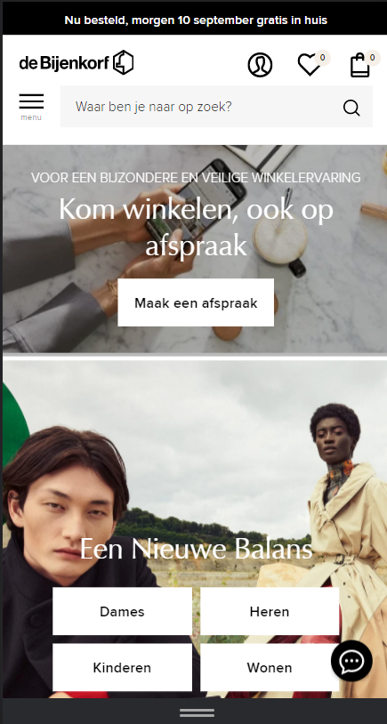

#### Screenshot(s) van de tweede pagina (small screen):
hier de naam van de pagina  
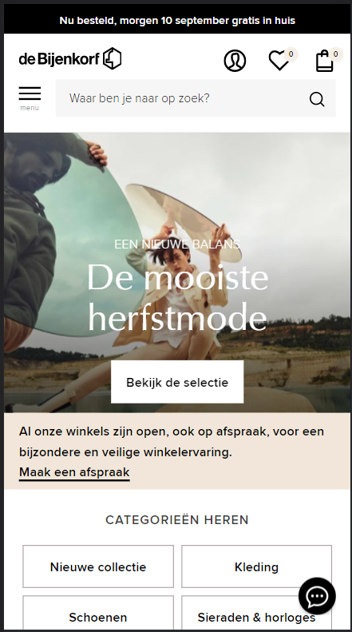
 

## Breakdownschets (week 1)

uitwerken na afloop 2e werkgroep

### de hele pagina: 
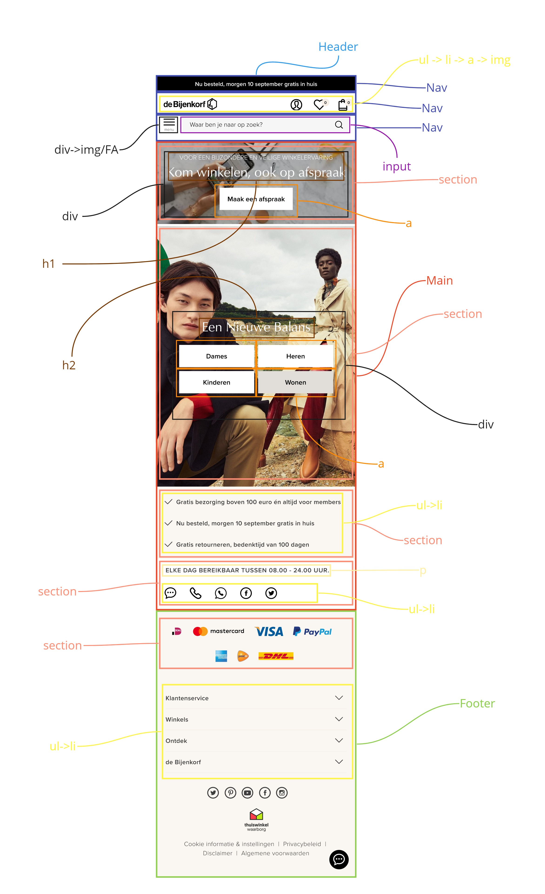

### dynamisch deel (bijv menu): 
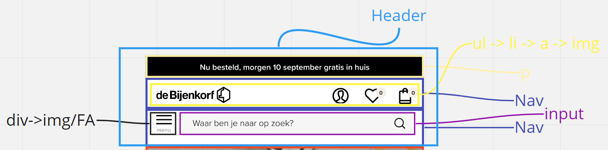

### wellicht nog een dynamisch deel (bijv filter): 
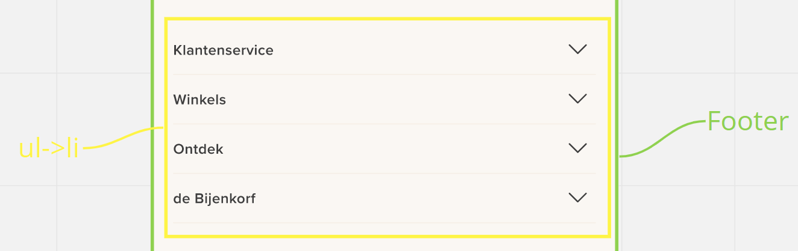

## Voortgang 1 (week 2)

uitwerken voor 1e voortgang

### Stand van zaken
Het maken van de header en navigatie ging zeer vlot en makkelijk verder had ik deze week niet veel
gewerkt aan de website.

Code voor header/navigatie:
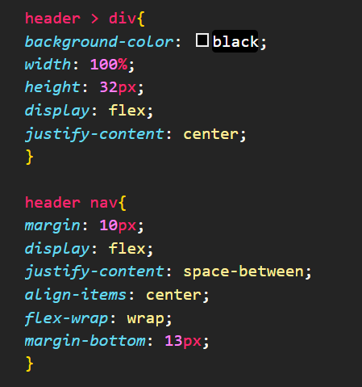

Header/navigatie:
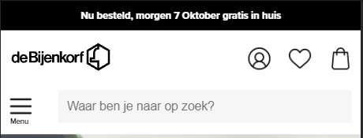

### Verslag van meeting
hier na afloop snel de uitkomsten van de meeting vastleggen

- Probeer je de nav in header in 1 element te zetten

## Voortgang 2 (week 3)

uitwerken voor 2e voortgang

### Stand van zaken
Ik heb verder de eerste pagina verder uitgewerkt en helemaal afgemaakt. Alles ging wel vlot alleen
de afbeeldingen vinden waren best wel lastig en de vier knoppen in het midden te krijgen ook. Met 
behulp van grid heb ik dat uiteindelijk voor elkaar gekregen.

Homepagina:
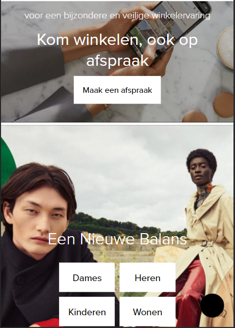

Tot slot ook de footer uitgewerkt

Footer:
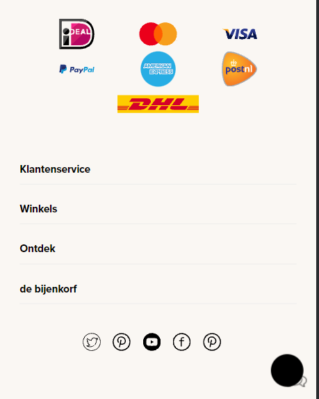

### Verslag van meeting
hier na afloop snel de uitkomsten van de meeting vastleggen

- er was opgemerkt dat ik mijn css veel pixels gebruikt er werd geadviseerd om wat andere waardes te gebruiken zoals (em,rem,vh) door deze manier ben ik consistent in mijn code.

## Toegankelijkheidstest (week 4)

uitwerken na test in 8e voortgang

### Bevindingen
-Bepaalde elementen waren niet tab baar

#### Titel eerste bevinding
de iconen in de header zijn niet tab baar

Door de list items in anchor tag te wrappen zodat die tab baar worden voor de gebruiker

#### Titel tweede bevinding. 
de letter grootte was misschien iets te klein

de font size groter maken

## Voortgang 3 (week 4)

uitwerken voor 3e voortgang

### Stand van zaken
Begonnen aan mijn tweede pagina waarbij alles wel lekker liep en ook ene begin gemaakt aan wat
interactieve elementen

Herenpagina:

wat een stuk lastiger was om bepaalde elementen naast elkaar te krijgen in de onderstaande afbeelding
is dit een sectie om mijn pagina waar het even lastig ging om de elementen naast elkaar te krijgen

Inspiratie section:
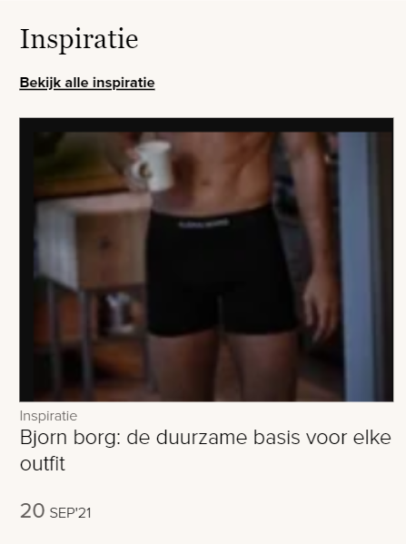

Met behulp van javascript had ik ook de datum bovenaan de pagina dynamisch gemaakt
Datum:

Javascript:
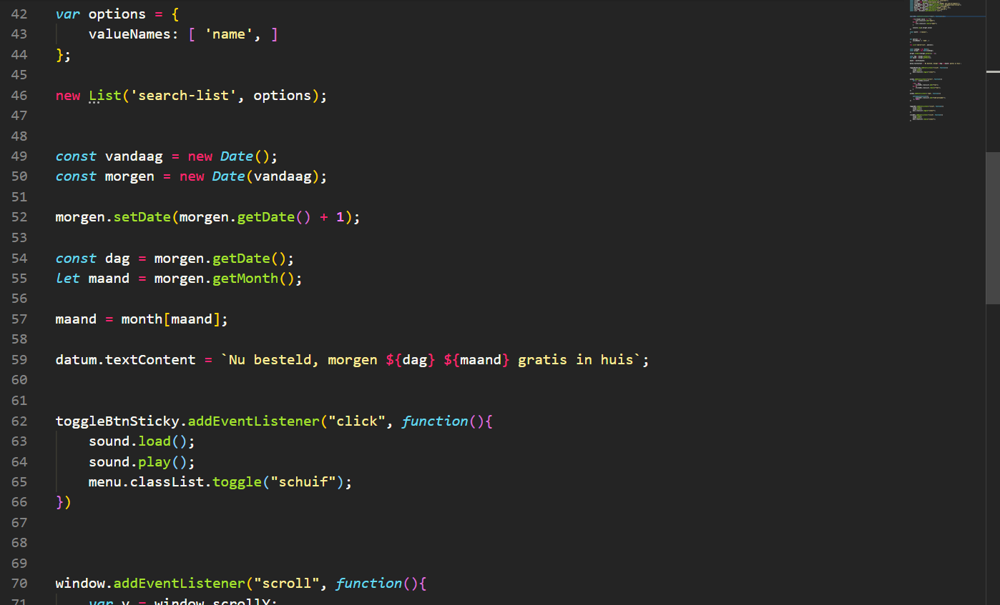

### Verslag van meeting
hier na afloop snel de uitkomsten van de meeting vastleggen

- Probeer comments te plaatsen en uit te kunnen leggen waarom je bepaalde div elementen heb gebruikt op je website

## Eindgesprek (week 5)

uitwerken voor eindgesprek

### Stand van zaken
hier dit ging goed & dit was lastig (neem ook screenshots op van delen van je website en code)

### Screenshot(s)

hier screenshot(s) van je eindresultaat

## Bronnenlijst

continu bijhouden terwijl je werkt

Nb. Wees specifiek ('css-tricks' als bron is bijv. niet specifiek genoeg).

1. bron 1
2. bron 2
3. ...

